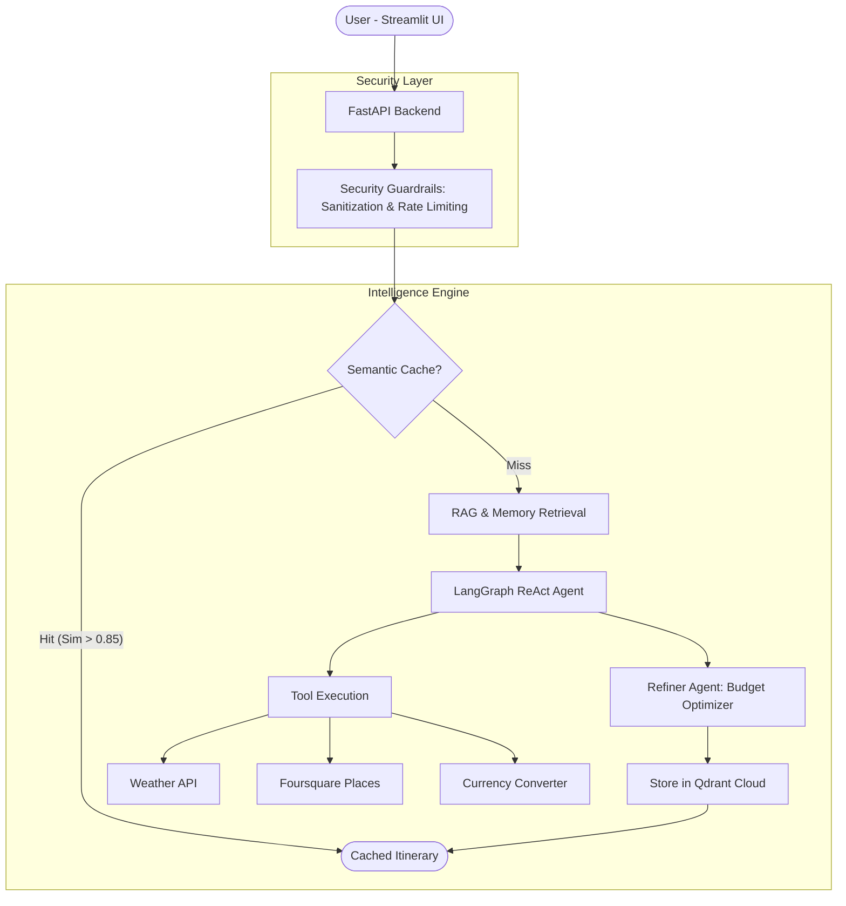

# VoyageMate AI


VoyageMate AI is an agentic AI-powered travel planning system that integrates real-time tool orchestration with semantic caching and long-term memory. The platform generates personalized itineraries, live weather insights, and detailed cost breakdowns using a multi-agent architecture.

---

## Architecture and System Flow

The system follows a tiered architecture designed for performance and security:



### 1. Semantic Caching Layer
The system utilizes a semantic cache built on Qdrant and HuggingFace Embeddings (all-MiniLM-L6-v2). Unlike traditional caches that require exact string matches, this layer converts queries into 384-dimensional vectors and performs a cosine similarity search. If a new query is semantically similar to a previous one (e.g., "Paris for 3 days" vs "3-day trip to Paris") with a score > 0.85, the cached response is served instantly. This reduces end-to-end latency by approximately 80% and significantly lowers operational LLM costs.

### 2. Retrieval-Augmented Generation (RAG) and Memory
VoyageMate AI implements a dual-memory system stored in Qdrant Cloud:
- **Domain Knowledge (RAG)**: The agent retrieves relevant travel facts and guide data to ground its responses in reality and prevent hallucinations.
- **User Memory**: The system stores user profiles and preferences (e.g., budget range, travel style) to provide personalized recommendations that improve over time.

### 3. Agentic Workflow
The core logic is orchestrated via LangGraph using a Planner-Refiner pattern:
- **Planner Agent**: Analyzes the query, retrieves context, and decides which external tools (Weather, Places, Calculator) to invoke.
- **Refiner Agent**: Reviews the initial itinerary to ensure it matches the user's budget and preferences, adding "hidden gems" and authentic local experiences.

---

## Core Features

- **Personalized Itineraries**: Generates 3-7 day plans combining popular attractions and off-beat destinations.
- **Real-Time Data**: Integrates OpenWeather for live forecasts and Foursquare for place discovery.
- **Financial Intelligence**: Dynamic cost estimation with currency conversion across 50+ currencies.
- **Security Guardrails**: Built-in rate limiting (5 requests/min), input sanitization, and protection against prompt injection.
- **Production Ready**: Containerized with Docker for deployment on Hugging Face Spaces.

---

## Tech Stack

| Component | Technology |
|---|---|
| **Frontend** | Streamlit |
| **Backend** | FastAPI, Uvicorn |
| **AI Framework** | LangChain, LangGraph |
| **Vector Database** | Qdrant Cloud |
| **LLM Provider** | Groq (Llama 3.1) |
| **Embeddings** | HuggingFace (all-MiniLM-L6-v2) |
| **Infrastructure** | Docker, Hugging Face Spaces |

---

## Deployment (Hugging Face Spaces)

This project is configured for deployment on Hugging Face Spaces using the Docker SDK.

1. **Environment Configuration**: Set the following Secrets in your Space settings:
   - `GROQ_API_KEY`, `QDRANT_API_KEY`, `QDRANT_URL`
   - `OPENWEATHER_API_KEY`, `FOURSQUARE_API_KEY`, `LOCATIONIQ_API_KEY`
2. **Dockerization**: The provided Dockerfile sets up a multi-process environment running both the FastAPI backend and the Streamlit frontend.
3. **Continuous Deployment**: Push your changes to the Hugging Face remote to trigger an automatic build.

---

## Installation and Local Setup

### Prerequisites
- Python 3.11+
- Qdrant Cloud account

### Setup
1. **Clone the repository**:
   ```bash
   git clone https://github.com/your-username/voyagemate-ai.git
   cd voyagemate-ai
   ```
2. **Install dependencies**:
   ```bash
   pip install -r requirements.txt
   ```
3. **Configure environment**:
   Create a `.env` file with the required API keys (refer to .env.example).

### Running the Application
```bash
# Terminal 1: Start the Backend
python -m uvicorn main:app --reload --port 8000

# Terminal 2: Start the Frontend
python -m streamlit run streamlit_app.py
```

---

## License
This project is licensed under the MIT License.
